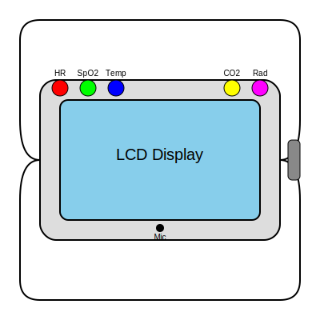

# [Biomonit Smartwatch](http://www.biomonit.com)

## Core Features
- Advanced multi-sensor platform for comprehensive health and environmental monitoring
- eSIM connectivity for standalone cellular capabilities
- Smartwatch functionality with health and safety focus

## Biosensor and Environmental Sensor Capabilities
1. Continuous heart rate monitoring and SpO2 measurement (MAX30101EFD+)
2. ECG (Electrocardiogram) on demand
3. Blood oxygen (SpO2) measurement
4. Skin temperature sensor
5. Stress level monitoring via heart rate variability (HRV)
6. Sleep tracking with detailed sleep stage analysis
7. Continuous glucose monitoring (CGM) integration*
8. Blood pressure estimation**
9. Chemical sensor for CO2 detection
10. Nuclear sensor (Geiger counter) for radiation detection
11. Barometric pressure sensing (LPS22HB)
12. 3-axis magnetometer and 3-axis accelerometer (LSM303AGR)
13. 6-axis inertial measurement unit (LSM6DSM)
14. High-quality audio input (MP34DT05-A)

## Connectivity
- eSIM for cellular data and calls without a paired smartphone
- Multi-band NB-IoT Module (BC95GJB-02-STD) for low-power, wide-area network connectivity
- Wi-Fi and Bluetooth 5.2 (via STM32WB55RG) for local connectivity
- GPS for location tracking and outdoor activity mapping

## Health and Fitness Features
- Real-time health data analysis and alerts
- Customizable health goals and tracking
- Fitness tracking for various activities (running, cycling, swimming, etc.)
- Guided breathing and meditation exercises
- Menstrual cycle tracking
- Environmental safety alerts (CO2 levels, radiation exposure)

## Smart Features
- Notifications for calls, messages, and apps
- Voice assistant integration
- Contactless payments
- Music control and storage
- Emergency SOS with location sharing

## Data Management and Privacy
- End-to-end encryption for health and environmental data
- HIPAA compliance for data storage and transmission
- Integration with electronic health records (EHR) systems
- Ability to share data with healthcare providers and safety officials

## Hardware Specifications
- High-resolution touch screen display
- Water-resistant design (suitable for swimming)
- Ultra-low power management system (BQ25570) with energy harvesting capabilities
- Long battery life with power-saving modes
- Wireless charging capability
- Dual-core processor (STM32WB55RG) for efficient data processing and communication

## Companion App
- Detailed health and environmental insights and trends
- Data visualization and reporting
- Integration with health, fitness, and environmental monitoring apps
- Customizable alerts and notifications

*Requires additional sensor patch
**Experimental feature, not for medical diagnosis
