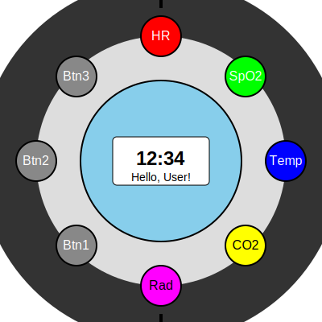

# [Biomonit Smartwatch](http://www.biomonit.com)

Biomonit Smartwatc based on H-Watch multi-sensor wearable platform which is built of the key components, listed below:
[biomonit/H-Watch: Smart Watch for Healthcare](https://github.com/biomonit/H-Watch)

### Components
The H-Watch is a highly integrated multi-sensor wearable platform which is built of the key components, listed below: 

* [MAX30101EFD+][max301010_url],  High-Sensitivity Pulse Oximeter and Heart-Rate Sensor for Wearable Health
* [LSM303AGR][lsm303agr_url],     Ultra-compact high-performance eCompass module
* [LPS22HB][lps22hb_url],         MEMS nano pressure sensor
* [LSM6DSM][lsm6dsm_url],         Ultra-low power, high accuracy and stability iNEMO 6DoF inertial measurement unit (IMU)
* [MP34DT05-A][mp34dt05_url],     MEMS audio sensor omnidirectional stereo digital microphone
* [BQ25570][bq25570_url],         Ultra Low power Harvester power Management IC with boost charger, and Nanopower Buck Converter
* [STM32WB55RG][stm32wb55_url],   Ultra-low-power dual core Arm Cortex-M4, Cortex-M0+ with 1 Mbyte of Flash memory, Bluetooth LE 5.2
* [BC95GJB-02-STD][bc95G_url],    Multi-band NB-IoT Module with Ultra-low Power Consumption
  

## Core Features
- Advanced multi-sensor platform for comprehensive health and environmental monitoring
- eSIM connectivity for standalone cellular capabilities
- Smartwatch functionality with health and safety focus

## Biosensor and Environmental Sensor Capabilities
1. Continuous heart rate monitoring and SpO2 measurement (MAX30101EFD+)
2. ECG (Electrocardiogram) on demand
3. Blood oxygen (SpO2) measurement
4. Skin temperature sensor
5. Stress level monitoring via heart rate variability (HRV)
6. Sleep tracking with detailed sleep stage analysis
7. Continuous glucose monitoring (CGM) integration*
8. Blood pressure estimation**
9. Chemical sensor for CO2 detection
10. Nuclear sensor (Geiger counter) for radiation detection
11. Barometric pressure sensing (LPS22HB)
12. 3-axis magnetometer and 3-axis accelerometer (LSM303AGR)
13. 6-axis inertial measurement unit (LSM6DSM)
14. High-quality audio input (MP34DT05-A)

## Connectivity
- eSIM for cellular data and calls without a paired smartphone
- Multi-band NB-IoT Module (BC95GJB-02-STD) for low-power, wide-area network connectivity
- Wi-Fi and Bluetooth 5.2 (via STM32WB55RG) for local connectivity
- GPS for location tracking and outdoor activity mapping

## Health and Fitness Features
- Real-time health data analysis and alerts
- Customizable health goals and tracking
- Fitness tracking for various activities (running, cycling, swimming, etc.)
- Guided breathing and meditation exercises
- Menstrual cycle tracking
- Environmental safety alerts (CO2 levels, radiation exposure)

## Smart Features
- Notifications for calls, messages, and apps
- Voice assistant integration
- Contactless payments
- Music control and storage
- Emergency SOS with location sharing

## Data Management and Privacy
- End-to-end encryption for health and environmental data
- HIPAA compliance for data storage and transmission
- Integration with electronic health records (EHR) systems
- Ability to share data with healthcare providers and safety officials

## Hardware Specifications
- High-resolution touch screen display
- Water-resistant design (suitable for swimming)
- Ultra-low power management system (BQ25570) with energy harvesting capabilities
- Long battery life with power-saving modes
- Wireless charging capability
- Dual-core processor (STM32WB55RG) for efficient data processing and communication

## Companion App
- Detailed health and environmental insights and trends
- Data visualization and reporting
- Integration with health, fitness, and environmental monitoring apps
- Customizable alerts and notifications

*Requires additional sensor patch
**Experimental feature, not for medical diagnosis

## Prototype v1

1. Watch body: A rounded rectangle represents the main body of the smartwatch.
2. LCD Screen: A blue rectangle in the center represents the LCD display.
3. Strap: Two curved paths represent the watch strap.
4. Sensors: Colored circles at the top of the watch face represent different sensors:
   - Red: Heart Rate (HR) sensor
   - Green: SpO2 sensor
   - Blue: Temperature sensor
   - Yellow: CO2 sensor
   - Magenta: Radiation sensor (Geiger counter)
5. Button: A gray rectangle on the right side represents a physical button.
6. Microphone: A small black circle at the bottom represents the microphone.

This is a simplified representation and doesn't show all the internal components like the processor, battery, or eSIM. 

1. The sensors are shown on the face of the watch for clarity, but in a real device, many of these might be on the back, in contact with the skin.
2. The CO2 and radiation sensors would likely need exposure to the environment, so their placement would need careful consideration in a real design.
3. The microphone is shown at the bottom, but its actual placement would depend on acoustics and design considerations.
4. Additional sensors like the pressure sensor, accelerometer, and magnetometer are not explicitly shown, as they would typically be internal components.

## Prototype v2

The updated design of the Biomonit smartwatch:

1. Wider dial: The dial around the watch is now significantly wider, taking up more of the watch face. This is represented by a thicker circular stroke 

2. Larger buttons and sensors: To take advantage of the wider dial, the buttons and sensors are now larger (40 pixels in diameter instead of 24), making them more prominent and potentially easier to interact with.

3. Adjusted layout: The positions of the sensors and buttons have been slightly adjusted to fit within the wider dial while maintaining a balanced layout.

4. Smaller main display: As a consequence of the wider dial, the main circular LCD display is slightly smaller, focusing more on the interactive elements around the edge.

5. Improved legibility: The larger sensors and buttons allow for slightly larger text, improving readability.

The elements of the watch remain the same as in the previous design:

- Heart Rate (HR) sensor at the top
- SpO2 sensor at the top right
- Temperature sensor on the right
- CO2 sensor at the bottom right
- Radiation sensor (Geiger counter) at the bottom
- Three buttons (Btn1, Btn2, Btn3) distributed on the left side of the dial

The small central LCD still displays the time (12:34) and a simple message ("Hello, User!").

This design emphasizes the multi-functional aspect of the watch, giving more space and prominence to the various sensors and interactive elements.
The wider dial could allow for more precise touch interactions or potentially incorporate additional sensors or controls in future iterations.

